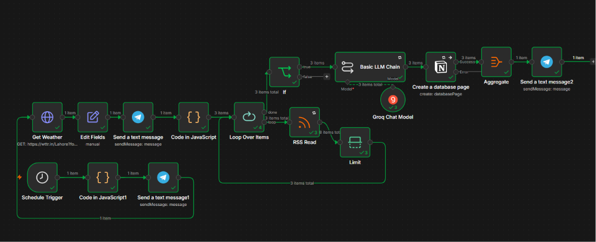
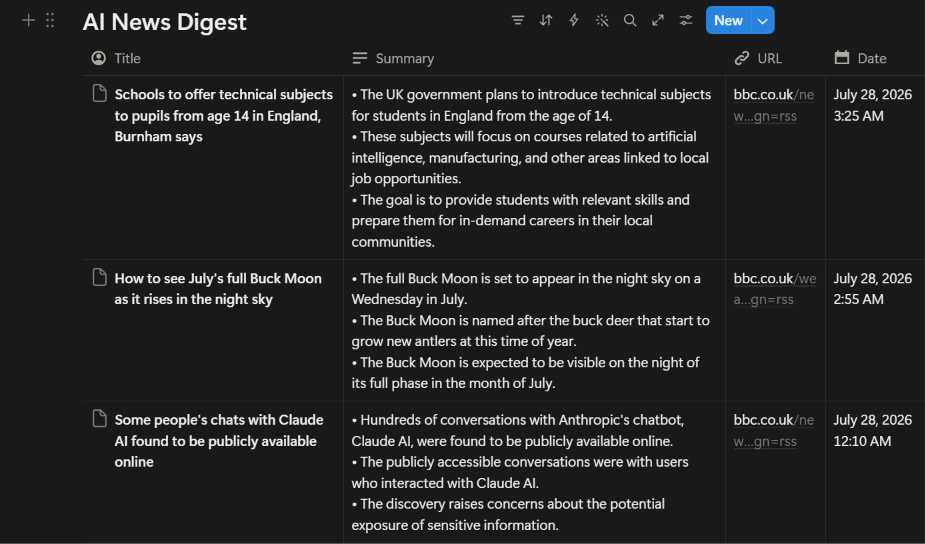

# 🤖 Personal AI Daily Briefing System

An automated system that collects daily news from RSS feeds, summarizes it using AI, saves it to Notion, and delivers it straight to Telegram — fully hands-free, every day.

---

## 📌 What This Project Does

This project solves a simple problem: staying updated with news takes too much time and scattered effort.

Instead of manually checking multiple news sites, this system:
1. **Collects** the latest articles automatically from RSS news feeds
2. **Summarizes** them using AI (Groq API / Llama models) into short, readable briefings
3. **Saves** the summarized briefing to a Notion page for record-keeping
4. **Sends** the final briefing directly to a Telegram chat/bot — so it's the first thing I see on my phone

Everything runs automatically on a schedule, with zero manual work after setup.

---

## ⚙️ How It Works (Workflow)

**Step-by-step logic:**
- An n8n scheduled trigger runs every morning
- RSS Feed node pulls the latest articles
- The article content is sent to the Groq API with a prompt asking for a clean, short summary
- The AI-generated summary is formatted and saved into a Notion database/page
- The same summary is sent as a message to a Telegram bot, so it arrives like a personal daily briefing

---

## 🛠️ Tech Stack (100% Free Tools)

| Tool | Purpose |
|------|---------|
| **n8n** | Workflow automation / orchestration |
| **Groq API** | AI summarization (LLM inference) |
| **Notion** | Storage / briefing archive |
| **Telegram Bot API** | Delivery of the final briefing |
| **RSS Feeds** | News source |

---

## 📷 Screenshots

*The complete automation workflow in n8n*

*Daily briefing received on Telegram*

*Briefing saved and archived in Notion*

---

## 🎯 Why I Built This

This project is part of my hands-on AI Automation learning journey, where I'm building real, working systems instead of just theory. It demonstrates:
- API integration (Groq)
- No-code workflow automation (n8n)
- Working with conditional logic, HTTP requests, and error handling
- Connecting multiple services together into one automated pipeline

---

## 🚀 Future Improvements

- [ ] Add multiple news categories (tech, world news, sports)
- [ ] Add sentiment analysis to the briefing
- [ ] Weekly summary digest in addition to daily
- [ ] Add voice-note briefing via text-to-speech

---

## 👤 Author

Built by Abdullah as part of a self-directed AI Automation learning program.

